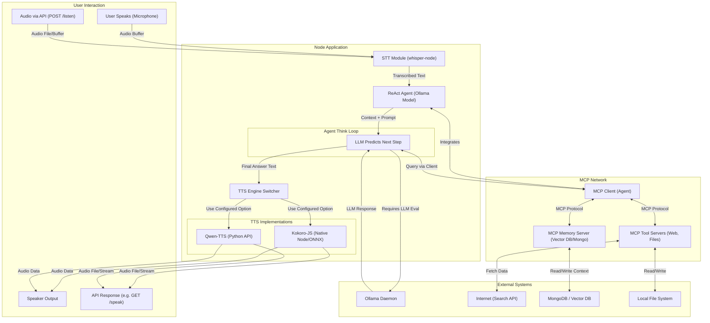

# Node.js Local Talking LLM Architecture

## 🏗️ Architecture Diagram

## System Components

1. **Hearing (STT)**: Receives raw audio via microphone OR via an exposed API endpoint (`POST /listen`) and transforms it to text using the local `whisper-node` bindings.
2. **Thinking (Agent/MCP)**: The Agent acts as an MCP Client. It consults with the `Ollama Daemon` and connected MCP servers for memory and tool utilization, executing a "think-act-observe" loop.
3. **Memory / Context**: MCP server handling transient (rolling context) and persistent (MongoDB/Vector DB) chat history.
4. **Tools & Skills**: Discrete MCP servers for local file system operations and web connectivity.
5. **Speaking (TTS)**: Dual-engine setup that delegates speech synthesis to either lightweight Node.js `kokoro-js` or high-fidelity Python-based Qwen-TTS based on configuration and availability. The resulting audio buffer can be played on local speakers OR returned as an API stream (`GET /speak`).