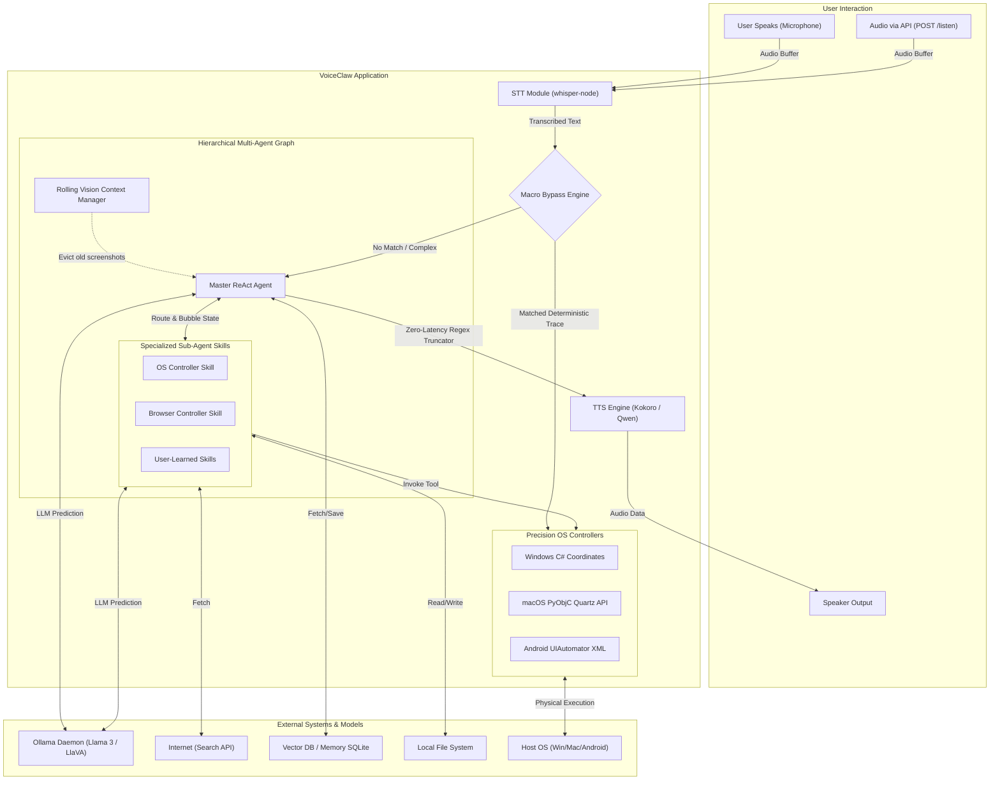

# VoiceClaw 2.0 Architecture

## 🏗️ Architecture Diagram

## System Components

1. **Hearing (STT)**: Receives raw audio via microphone OR via an exposed API endpoint and transforms it to text using the local `whisper-node` bindings.
2. **Macro Bypass Engine**: The lightning-fast gatekeeper. If the user's intent matches a previously learned deterministic physical shortcut (Macro), it routes execution natively to OS controllers instantly (0ms latency), completely bypassing the LLM.
3. **Thinking (Hierarchical Graph)**: The main brain. The Master Agent evaluates context and dynamically routes execution into isolated `CompiledStateGraph` Sub-Agents (Skills) for hyper-focused tasks. State bubbles back up flawlessly.
4. **Precision OS Controllers**: The physical interactors. Unlike basic wrappers, VoiceClaw interacts exactly like a mouse using high-level native bridging: C# `user32` for Windows, PyObjC Quartz for macOS, and ADB XML tree extractions for Android.
5. **Rolling Context Manager**: Intercepts the conversational history to aggressively summarize or drop old `image_url` payloads, preventing Out-Of-Memory system crashes during dense visual analysis loops.
6. **Speaking (TTS)**: Instantaneous text-to-speech. By stripping Markdown using native regex instead of a secondary LLM summarization pass, it feeds text directly to `kokoro-js` with zero algorithmic latency.