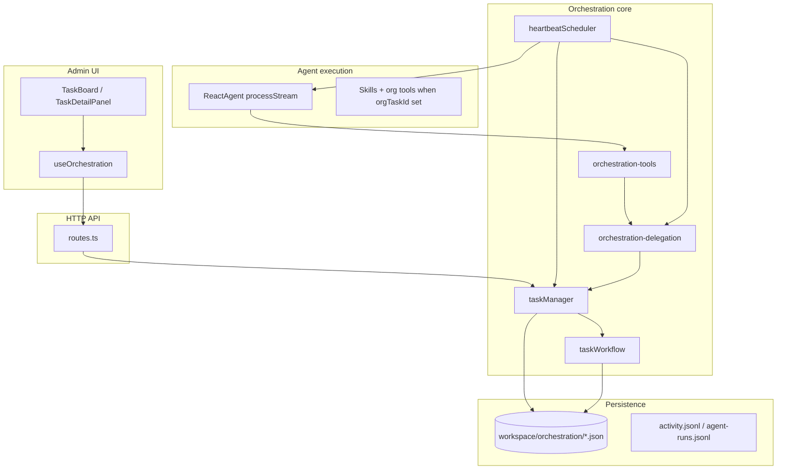
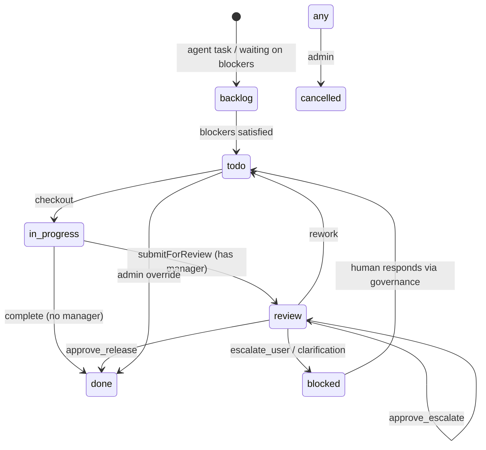
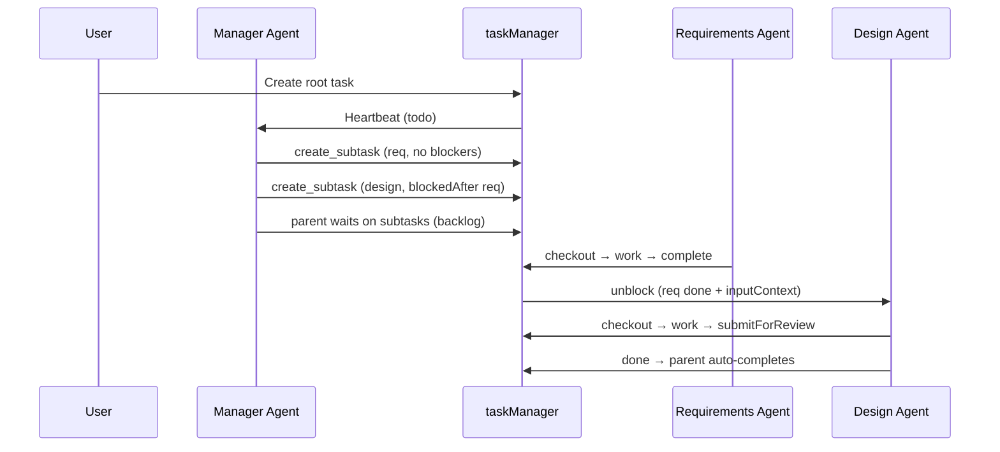

# Orchestration task handling architecture

This document describes how tasks are modeled, stored, delegated, reviewed, and executed in the voice-to-voice orchestration layer (Paperclip-style org simulation).

**Related code:** `src/orchestration/` · **Data:** `workspace/orchestration/*.json`

---

## Layered architecture



| Layer | File(s) | Responsibility |
|--------|---------|----------------|
| Types | `types.ts` | Task model, statuses, review decisions, permissions |
| Workflow rules | `task-workflow.ts` | Blockers, checkout, review chain, rework, unblock dependents |
| Orchestration | `task-manager.ts` | CRUD, checkout/complete, events, admin `updateTask` |
| Delegation | `orchestration-delegation.ts` | Manager spawns subtasks (tools, JSON, LLM fallback) |
| Agent tools | `orchestration-tools.ts` | `list_team_members`, `create_subtask`, `list_my_subtasks` |
| Execution | `heartbeat-scheduler.ts` | Picks next task, runs agent, applies review/delegation |
| Persistence | `store.ts` | Load/save JSON; append-only activity logs |
| Governance | `governance.ts` | Human approvals (hire, high-priority task, clarification) |
| HTTP | `routes.ts` | REST API under `/orchestration` |
| Admin UI | `src/admin/app/...` | Task board, detail panel, hooks |

---

## Task model

Defined in `src/orchestration/types.ts` as `Task`.

### Key fields

| Field | Purpose |
|--------|---------|
| `parentTaskId` | Child of another task (delegation tree) |
| `rootTaskId` | User-created epic; all agent subtasks point here |
| `source` | `user` (root) or `agent` (subtask) |
| `assigneeId` | Agent responsible for execution |
| `blockedBy` | Task IDs that must be `done` or `cancelled` before work starts |
| `reviewerId` / `reviewChain` | Management-chain review |
| `submittedById` / `submittedAt` | Who submitted for review |
| `inputContext` | Upstream outputs merged when blockers complete |
| `checkedOutBy` | Agent currently working the task |
| `reworkCount` | Rework attempts (capped by company settings) |

### Two hierarchies

1. **Parent / child** — `parentTaskId` + `rootTaskId` (user epic → agent subtasks).
2. **Dependencies** — `blockedBy[]` (DAG: task B waits until every blocker is terminal).

### Sources

- **`user`** — Top-level work from admin/API; becomes `rootTaskId` for the tree.
- **`agent`** — Subtasks; must hang off a user root (`createTask` enforces `rootTaskId` or `parentTaskId`).

---

## Status machine



| Status | Meaning |
|--------|---------|
| `backlog` | Waiting on `blockedBy` or inactive root |
| `todo` | Ready for assignee |
| `in_progress` | Checked out by an agent |
| `review` | Waiting on `reviewerId` in management chain |
| `blocked` | Waiting on **human** approval (governance), not `blockedBy` |
| `done` / `cancelled` | Terminal |

> **Naming note:** `blocked` (status) ≠ `blockedBy` (dependency list). Dependency waiting uses `backlog`, not `blocked`.

---

## Blocker / dependency engine

Implemented in `task-workflow.ts`.

- `areBlockersSatisfied(task)` — true when every `blockedBy` id is `done` or `cancelled`.
- `canCheckout` — fails if blockers are open or root is inactive.
- `unblockDependents(completedTaskId)` — on `done`, promotes dependents `backlog` → `todo`, **rebuilds** the `## Upstream outputs` section in `inputContext` from **all transitive blockers** (not just the task that just finished), emits `task:unblocked`.
- Work products may include `filePath` and `assetPaths[]`; these are listed under **Asset paths** for downstream agents (e.g. nth child in a pipeline like draft → visuals → PDF).

### Sequential example (requirements → design)

| Task | `blockedBy` (default) | Unblocks when |
|------|------------------------|----------------|
| Gather requirements | `[]` (none) | User root / epic is active |
| Product design | `[requirements-task-id]` or `blockedAfter` in batch | Requirements subtask **done** |

**Defaults (as of 2026-05-30):**

- New subtasks default to **no** `blockedBy` on the parent — they start when the user root is active.
- Spawning **multiple** subtasks in one batch: later items default to `blockedBy: [previous]` if omitted.
- After delegation, the **parent stays `backlog`** until all delegated subtasks are `done`, then auto-completes.
- Use `blockedBy: ["parent"]` only when work must wait for the parent task itself to finish first.

### How agents express dependencies

**`create_subtask` tool** — optional `blockedBy: ["parent"]` or prior subtask id/title from `list_my_subtasks`.

**Delegation JSON** (end of manager output or LLM batch):

```json
{
  "spawnTasks": [
    {
      "title": "Gather requirements",
      "description": "...",
      "assigneeId": "agent-id",
      "priority": "high"
    },
    {
      "title": "Product design",
      "description": "...",
      "assigneeId": "agent-id",
      "blockedAfter": "Gather requirements",
      "priority": "high"
    }
  ]
}
```

`blockedAfter` resolves to a sibling title when tasks are created in one batch (`orchestration-delegation.ts`).

**Admin UI** — edit **Depends on** (`blockedBy`) on any task via `PUT /orchestration/tasks/:id`.

---

## End-to-end flows

### 1. User creates work

`POST /orchestration/tasks` → `taskManager.createTask` → `todo` (or approval queue if high/critical and company setting `requireApprovalForHighPriorityTasks`).

### 2. Agent pickup (heartbeat)

`heartbeat-scheduler.ts`:

1. `getNextTask(agentId)` — **review** queue first, then **work** queue.
2. Work mode: `checkout` → `in_progress`.
3. Build context (company mission, goal, task, dependency context).
4. Run `ReactAgent.processStream` with `orgAgentId` + `orgTaskId`.

Auto-triggers heartbeat on: `task:created`, `task:review_needed`, `task:unblocked`.

**Scheduled interval:** default **15 seconds** per agent (`DEFAULT_HEARTBEAT_INTERVAL_MS`). Set `ORG_HEARTBEAT_INTERVAL_MS` in `.env` (minimum 15000) to override all agents without editing `agents.json`. Task events still trigger immediate heartbeats regardless of interval.

### 3. Worker completes

`taskManager.complete`:

- Assignee has **`reportsTo` chain** → `submitForReview` → `review` + first manager as `reviewerId`.
- No manager → `done` + `unblockDependents`.

### 4. Manager delegates

For agents with **direct reports**, at end of work heartbeat:

1. `ensureTeamDelegation(manager, parentTask, output)` — tools / JSON / LLM fallback.
2. If subtasks were created: save delegation work product, parent `blockedBy` = all subtask ids, parent `backlog` until team finishes, then **auto-complete** parent.
3. If no subtasks (leaf manager): `complete(parent)` as before.

Default subtask `blockedBy` is `[]` for the first spawned task; batch order defaults later tasks to the **previous** subtask unless `blockedBy` / `blockedAfter` is set.

### 5. Review

**Agent:** heartbeat `review` mode → JSON `decision` → `processReviewDecision`.

**Admin:** `POST /tasks/:id/review` with `reviewerId: "admin"` → human bypass via `buildReviewContext`.

| Decision | Effect |
|----------|--------|
| `approve_escalate` | Move reviewer up `reportsTo` chain |
| `approve_release` | Mark `done`, unblock dependents |
| `rework` | Back to `todo`, increment `reworkCount` |
| `reassign` | New assignee, `todo` |
| `escalate_user` / `request_clarification` | Governance approval + status `blocked` |

### 6. Human governance

`governance.ts` handles pending approvals; clarification/work escalation unblocks tasks when the board responds.

### 7. Child → parent manager Q&A (org agents)

| Path | Audience |
|------|----------|
| `ask_parent_manager` tool / `POST .../tasks/:id/ask-parent` | **Parent manager** (`reportsTo`, or assignee of parent task) |
| `POST .../tasks/:id/clarifications` + `request_clarification` review | **Human board** (governance approvals) |

Flow:

1. Child calls `ask_parent_manager` with a question → comment `[Question for parent]`, label `awaiting-parent`, parent heartbeat triggered.
2. Child is skipped in work queue until answered.
3. Parent uses `list_pending_subtask_questions` + `reply_to_subtask_question` (or `POST .../tasks/:subtaskId/parent-answer`).
4. Answer stored as `[Parent answer]` comment + merged into subtask `inputContext` → child heartbeat resumes.

---

## Sequence: manager delegates sequential work



---

## HTTP API (tasks)

| Method | Path | Role |
|--------|------|------|
| GET | `/orchestration/tasks` | List (optional `companyId`, `assigneeId`) |
| POST | `/orchestration/tasks` | Create root task |
| GET | `/orchestration/tasks/:id` | Get one |
| PUT | `/orchestration/tasks/:id` | Admin edit (title, status, assignee, **blockedBy**) |
| PUT | `/orchestration/tasks/:id/status` | Status only |
| POST | `/orchestration/tasks/:id/checkout` | Agent lock |
| POST | `/orchestration/tasks/:id/release` | Release checkout |
| POST | `/orchestration/tasks/:id/complete` | Finish work |
| POST | `/orchestration/tasks/:id/submit` | Submit for review |
| POST | `/orchestration/tasks/:id/review` | Review decision |
| POST | `/orchestration/tasks/:id/reassign` | Reassign shortcut |
| POST | `/orchestration/tasks/:id/subtasks` | Manual subtask |
| POST | `/orchestration/tasks/:id/ask-parent` | Child asks parent manager |
| POST | `/orchestration/tasks/:id/parent-answer` | Parent answers on subtask |
| POST | `/orchestration/tasks/:id/delegate-team` | Re-run team delegation (optional `supersede: true`) |
| POST | `/orchestration/tasks/:id/refresh-context` | Repair `inputContext` upstream section for one task |
| POST | `/orchestration/tasks/refresh-context` | Bulk repair under `{ rootTaskId }` |
| GET | `/orchestration/tasks/:id/subtasks` | List children |
| GET | `/orchestration/tasks/:id/work-products` | Artifacts |
| GET/POST | `/orchestration/tasks/:id/comments` | Comments |
| DELETE | `/orchestration/tasks/:id` | Delete |

---

## Agent permissions

From `OrgAgent.permissions` in `agents.json`:

| Flag | Effect |
|------|--------|
| `canCreateTasks` | May call `create_subtask` / spawn subtasks |
| `canAssignTasks` | May assign to direct reports |
| `canApproveWork` | May `approve_release` without escalating |

Management chain comes from `reportsTo` on each agent.

---

## Persistence

| File | Contents |
|------|----------|
| `workspace/orchestration/tasks.json` | All tasks |
| `workspace/orchestration/comments.json` | Task comments |
| `workspace/orchestration/workProducts.json` | Deliverables (metadata; files on disk under artifacts/) |
| `workspace/orchestration/artifacts/{rootTaskId}/{taskId}/` | Per-task folder: `output.md`, `manifest.json`, chapters, images, PDFs |
| `workspace/orchestration/approvals.json` | Governance queue |
| `workspace/orchestration/activity.jsonl` | Audit log |
| `workspace/orchestration/agent-runs.jsonl` | Heartbeat run log |

Writes use temp file + rename (`store.ts`). `mutateTasks()` serializes read-modify-write for `tasks.json` on hot paths. In-memory cache per process.

---

## Backward compatibility and opt-in pipeline mode

**Default behavior is unchanged** unless you explicitly enable pipeline features.

| Category | Default | Opt-in |
|----------|---------|--------|
| Model load/unload | `acquire` / `release` restores master after non-master runs | Pin + lighter post-ComfyUI restore when root has label `pipeline-mode` |
| Review | Every worker subtask waits for manager `approve_release` | `autoReleasePipelineSubtasks: true` **and** root label `pipeline-mode` |
| Re-delegation | `ensureTeamDelegation` returns existing subtasks (no duplicate spawn) | `supersede: true` on `delegate-team` cancels overlapping open subtasks (pipeline roots only) |
| Parent checkout | Managers can checkout parent epics as today | Pipeline-mode parents with open subtasks are blocked from worker checkout |
| Context repair | `unblockDependents` rebuilds upstream on new unblocks only | `POST .../refresh-context` for manual repair |

### Enabling the digital product pipeline

1. Add label **`pipeline-mode`** to the root task (`PUT /orchestration/tasks/:id` → `labels`).
2. Optionally set company `settings.autoReleasePipelineSubtasks: true` for auto-release of leaf worker subtasks after submit.
3. After deploy, repair stale tasks: `POST /orchestration/tasks/refresh-context` with `{ "rootTaskId": "..." }`.

### Pipeline model pin (ComfyUI)

- ComfyUI **still unloads Ollama** before every generate job (8GB VRAM safety).
- When pinned, **post-ComfyUI restore** skips reloading master if the suspended model matches the pinned pipeline model.
- Pin is acquired per heartbeat on pipeline roots; released when root reaches `done` or `cancelled`.
- Optional TTL: `ORG_PIPELINE_PIN_TTL_MS` in `.env`.

### Work product chapter materialization

On `saveWorkProduct`, if content is long (≥2000 chars) and contains `## CHAPTER N` headers, missing `chapter-*.md` files are written under the task artifact folder. Skips when chapters already exist or agent wrote files via `write_file`. Never overwrites existing chapter files.

### Heartbeat delegation fix

When `ensureTeamDelegation` returns **existing** subtasks (not newly spawned), the heartbeat **does not** call `markParentAwaitingSubtasks` again — prevents accidental `blockedBy` resets on manager re-runs.

### Awaiting user input (STOP AND ASK)

When heartbeat output indicates the agent is **waiting for human selection or approval** (e.g. “PAUSED — WAITING FOR YOUR SELECTION”, or task description contains `STOP AND ASK`), the scheduler:

- Saves the work product
- Creates a **`request_clarification`** approval (human governance queue)
- Sets task status to **`blocked`** with label `awaiting-user`
- **Does not** call `complete()` or delegate subtasks

After you respond via `POST /orchestration/approvals/:id/clarification-response`, the task returns to **`todo`**, your answer is merged into `inputContext`, and the assignee heartbeat resumes.

---

## Strengths

1. Clear split: `taskManager` (orchestration + events) vs `taskWorkflow` (rules).
2. Real dependency graph with context propagation on unblock.
3. Management-chain review via `reportsTo`.
4. Event-driven heartbeats on create / review / unblock.
5. Delegation fallbacks: tools → JSON in output → LLM batch spawn.
6. Admin human override for status, dependencies, and review.

---

## Known gaps and risks

| Issue | Description |
|-------|-------------|
| Subtasks API | `POST .../subtasks` accepts optional `blockedBy` array. |
| Dual writers | Mitigated via `mutateTasks()` on hot paths; not full transactions. |
| `blocked` vs `blockedBy` | Easy to confuse in UI and logs. |
| Org tool-only runs | With `orgTaskId`, agent gets orchestration tools only—not full skills in same heartbeat. |
| No cycle detection | Circular `blockedBy` can deadlock in `backlog`. |
| Admin bypass | `updateTask` can set `done` without review or work products. |
| Single process | JSON store cache is not safe for multi-instance deployment without shared storage. |

### Possible improvements

- Validate `blockedBy` for cycles on create/update.
- Optional: allow org heartbeat to use delegation tools **and** domain skills.
- Board UI: dependency edges / “waiting on” column.

---

## File reference

| Concern | Primary file |
|---------|----------------|
| Task CRUD & events | `src/orchestration/task-manager.ts` |
| Blockers & review rules | `src/orchestration/task-workflow.ts` |
| Delegation & spawn | `src/orchestration/orchestration-delegation.ts` |
| Agent-facing tools | `src/orchestration/orchestration-tools.ts` |
| Heartbeat loop | `src/orchestration/heartbeat-scheduler.ts` |
| Wire-up to LLM | `src/api/server.ts` (heartbeat handler) |
| Org run tools | `src/agents/react-agent.ts` (`orgTaskId`) |
| REST routes | `src/orchestration/routes.ts` |
| Admin UI hooks | `src/admin/app/src/hooks/useOrchestration.ts` |

---

*Last updated: 2026-05-31*
