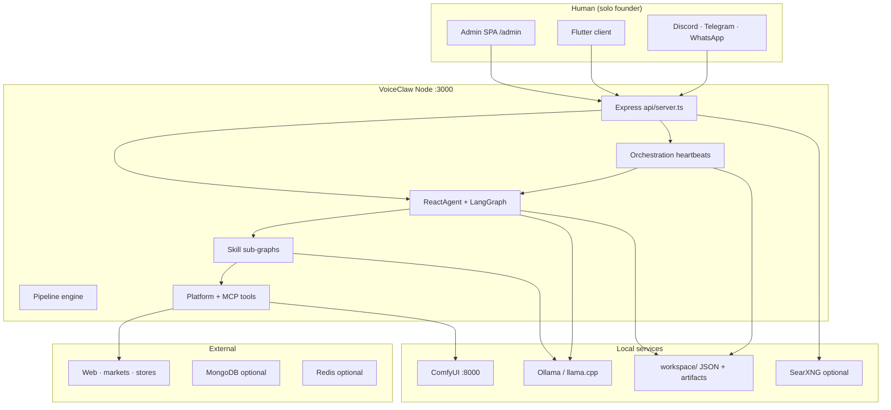
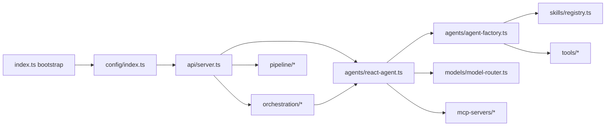
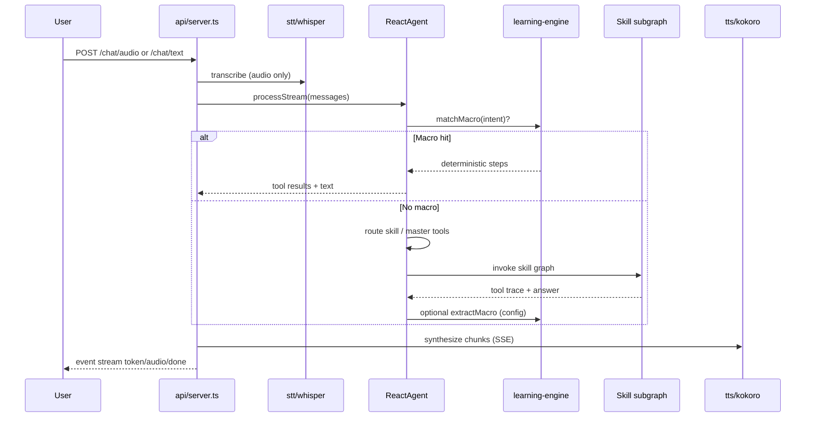
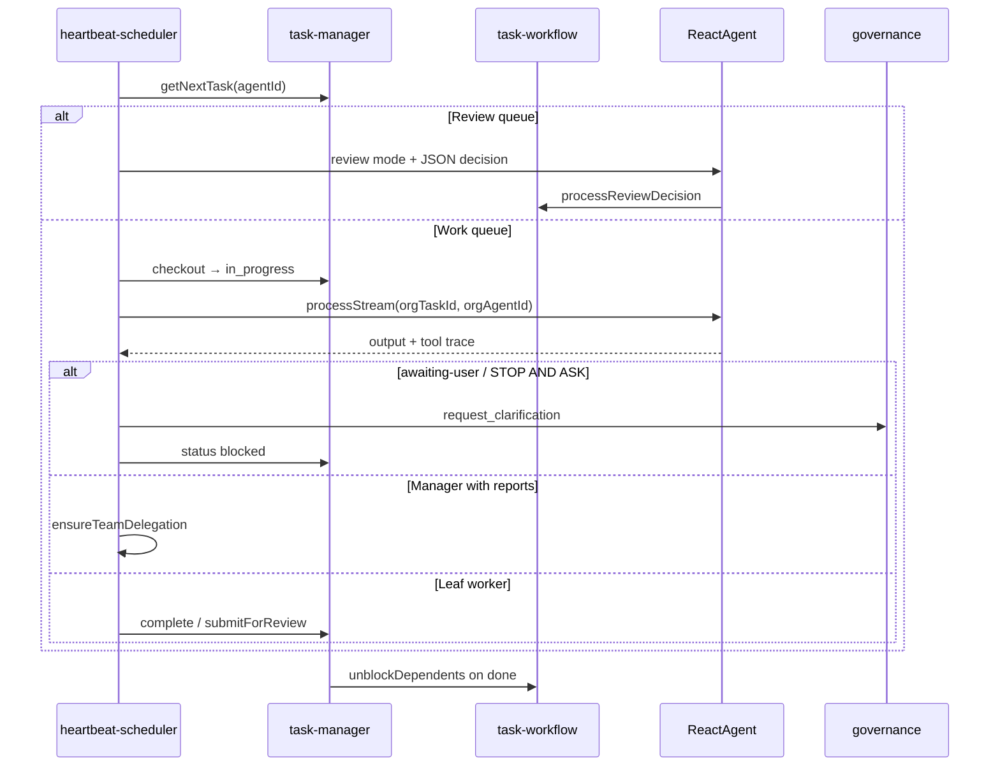
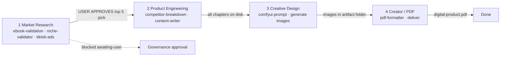
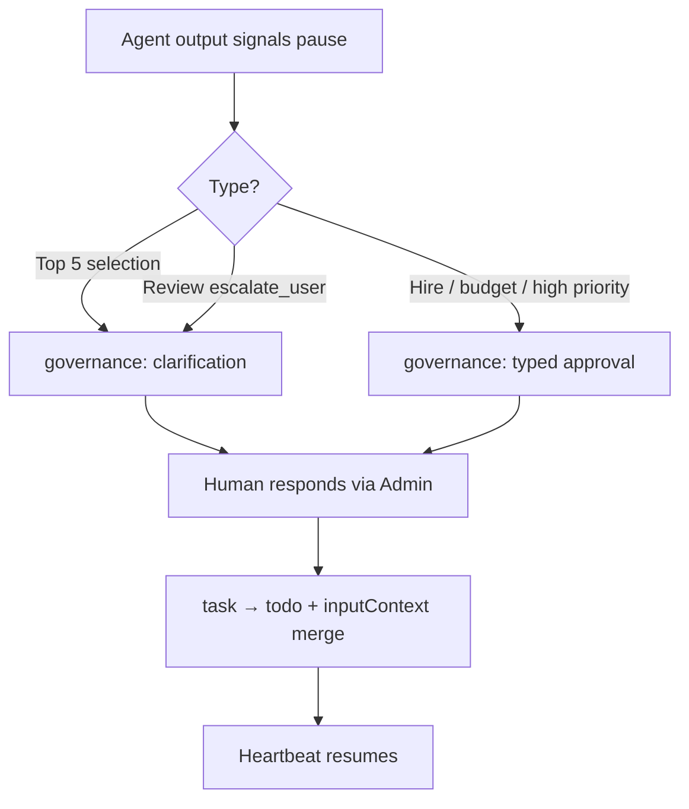
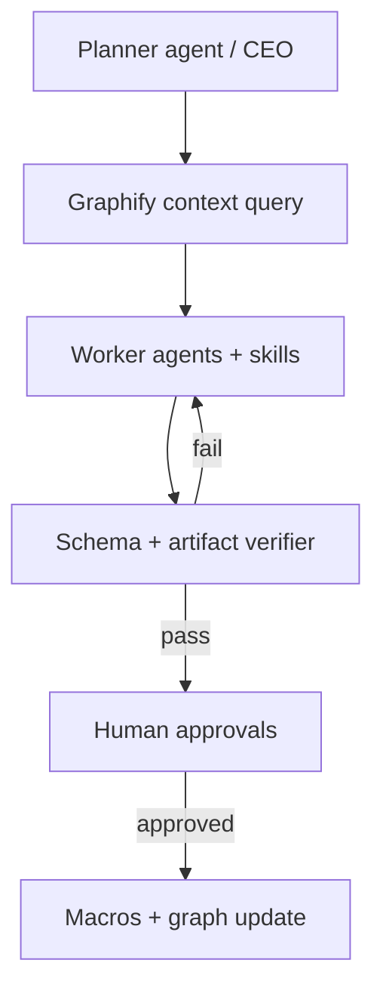
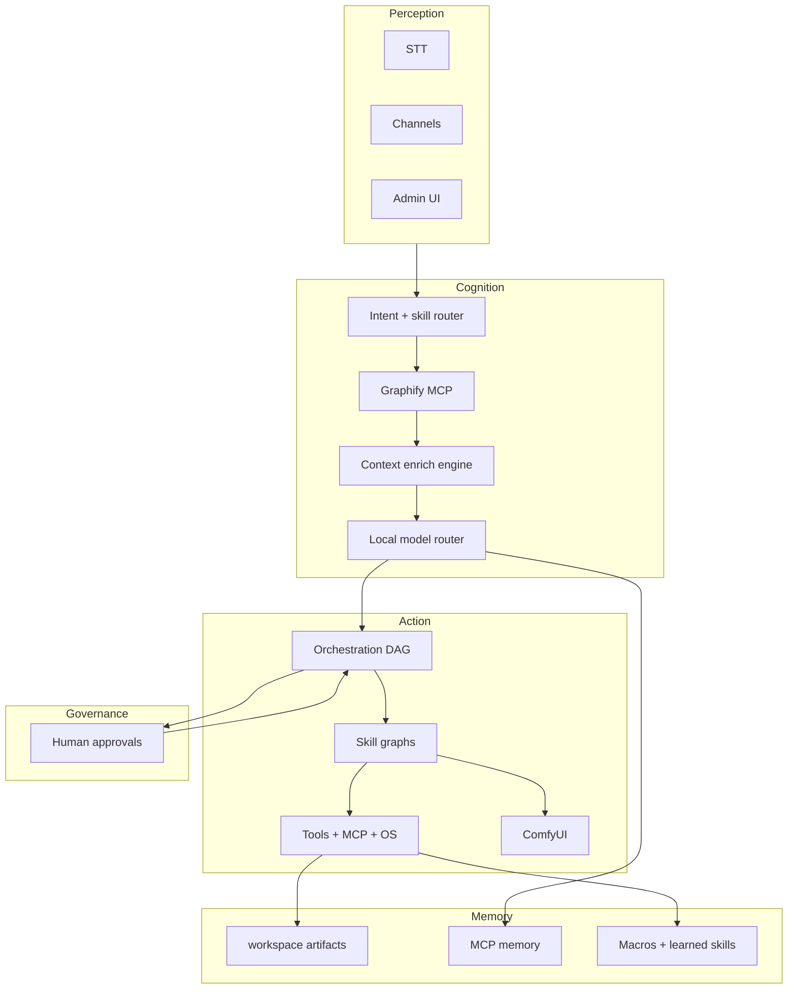

# VoiceClaw (voice-to-voice) — Project Architecture Deep Dive

**Generated:** 2026-06-04  
**Graphify (latest update):** `graphify-out/GRAPH_REPORT.md` — **2740 nodes · 7801 edges · 91 communities** (2026-06-04 incremental merge)  
**Previous baseline:** 2387 nodes · 6088 edges · 44 communities (2026-06-02)  
**This update diff:** +245 nodes, +1408 edges (235 changed code files AST + key doc semantic)  
**Purpose:** Per-module flow, gaps, when/where/why each layer runs, approval gates, and recommended algorithms for a highly agentic local-first stack.

---

## Table of contents

1. [Executive summary](#1-executive-summary)
2. [Graphify knowledge graph (use before changing code)](#2-graphify-knowledge-graph-use-before-changing-code)
3. [System context architecture](#3-system-context-architecture)
4. [End-to-end request flows](#4-end-to-end-request-flows)
5. [Layer map — every major area](#5-layer-map--every-major-area)
6. [Digital product pipeline (competitor upgrade)](#6-digital-product-pipeline-competitor-upgrade)
7. [Gaps, risks, and dead ends](#7-gaps-risks-and-dead-ends)
8. [What requires human approval](#8-what-requires-human-approval)
9. [Recommended algorithms & engines](#9-recommended-algorithms--engines)
10. [Highly agentic target architecture](#10-highly-agentic-target-architecture)
11. [File reference index](#11-file-reference-index)

---

## 1. Executive summary

**VoiceClaw** is a local-first **one-person AI company** platform: Express API + LangGraph ReAct agent + skill sub-graphs + orchestration (companies, tasks, heartbeats, governance) + voice/chat/channels + optional ComfyUI and trading pipelines.

| Question | Answer |
|----------|--------|
| **Why** | Solo founder runs a virtual org (CEO, engineers, analysts) with budgets, approvals, and artifact handoff — not a single chatbot. |
| **When** | Heartbeats every ~15s per org agent; event-driven wake on task create/review/unblock; user chat on demand via `/chat/*`. |
| **Where** | Node process `:3000`; state in `workspace/` JSON + artifacts; models via Ollama / llama.cpp / cloud providers in `models-config.json`. |
| **Who uses it** | You (admin UI), Flutter client, Discord/Telegram/WhatsApp channels, scheduled pipelines. |

**Core runtime loop:** Input → optional **macro bypass** (deterministic tool replay) → **ReactAgent** (route to skill or org tools) → tools/MCP/OS → TTS/SSE reply → optional memory/macro learning.

---

## 2. Graphify knowledge graph (use before changing code)

### 2.1 Why graphify first

Graphify surfaces **cross-file surprises** that line-by-line reading misses. Example from the existing report:

- `VoiceClaw Project` ↔ `Hierarchical Multi-Agent Graph` ↔ `Macro Bypass Engine` (documentation hyperedge)
- `test()` inferred calls into `prompt-context.ts`, `skill-route-guard.ts`, `pii-sanitizer.ts` (test coverage bridges)
- God nodes: `TaskManager`, `TaskWorkflowEngine`, generic utilities (`push`, `slice`) from large dependency fan-in

### 2.2 Outputs (updated 2026-06-04)

| Artifact | Path | Stats / use |
|----------|------|-------------|
| Interactive graph | `graphify-out/graph.html` | Browse 91 communities in browser |
| Audit report | `graphify-out/GRAPH_REPORT.md` | 2740 nodes · 7801 edges |
| GraphRAG JSON | `graphify-out/graph.json` | MCP query, path, explain |
| Update script | `scripts/graphify-update-merge.py` | Re-run: `python scripts/graphify-update-merge.py` |

### 2.3 Commands to refresh

```powershell
# Incremental update (changed files only)
python scripts/graphify-update-ast.py
python scripts/graphify-update-merge.py

# Full corpus (slow)
/graphify . --mode deep
```

### 2.4 Graph communities (labeled for navigation)

| Community theme | Representative nodes | Cohesion |
|-----------------|---------------------|----------|
| Orchestration core | `TaskManager`, `HeartbeatScheduler`, `GovernanceEngine` | Medium |
| Agent execution | `ReactAgent`, `AgentFactory`, `MCPClientManager` | Medium |
| Admin SPA | `useOrchestration`, `TaskBoard`, settings panels | Low–medium |
| Flutter client | `LocalVoiceApp`, channel handlers | Low |
| Digital pipeline | `isPipelineCoordinatorAwaitingSubtasks`, `pipeline-mode` label | High (small) |
| Docs/planning | Implementation Playbook, Four-Phase Roadmap | High |

---

## 3. System context architecture

### 3.1 C4-style context



### 3.2 Container diagram (backend modules)



### 3.3 Data stores

| Store | Path / service | Written by | Read by |
|-------|----------------|------------|---------|
| Hot config | `workspace/config.json` | Admin, API POST `/config` | `configManager` (watcher) |
| Orchestration | `workspace/orchestration/*.json` | `store.ts`, `taskManager` | Heartbeats, admin API |
| Artifacts | `workspace/orchestration/artifacts/{root}/{task}/` | Skills, `task-artifacts`, PDF tools | Downstream tasks via `inputContext` |
| Chats | `workspace/chats/` | `agent-history` | `/chats`, admin chat |
| Macros | `workspace/learned/macros/` | `learning-engine` | `ReactAgent` bypass |
| Learned skills | `workspace/learned-skills*` | `learning-engine`, creator | `SkillRegistry` |
| Pipelines | `workspace/pipelines.json` | `pipeline-engine` | Scheduler ticker |
| Models | `workspace/models-config.json` | Admin models UI | `model-registry` |

---

## 4. End-to-end request flows

### 4.1 Voice / text chat (user-facing)



**When:** Interactive chat, admin voice pill, Flutter client.  
**Why:** Lowest latency path for founder; bypasses org task state unless `orgTaskId` passed from heartbeat handler.

### 4.2 Org heartbeat (one-person company)



**When:** Every `ORG_HEARTBEAT_INTERVAL_MS` (default 15s) + events `task:created`, `task:review_needed`, `task:unblocked`.  
**Where:** `src/orchestration/heartbeat-scheduler.ts` wired in `api/server.ts`.  
**Gap:** Org runs often get **orchestration tools only**, not full domain skills in the same heartbeat (see §7).

### 4.3 Digital product pipeline (4-step SOP)

Aligns with `docs/competitor-upgrade-pipeline-sop.md` and digital-product skills in `src/skills/digital-products/skill-manifest.json`.



**Enablers in code:**

- Root task label `pipeline-mode` → model pin, auto-release subtasks (company setting)
- `write_file` / `pdf_merge_pipeline` / artifact paths in `task-artifacts.ts`, `task-response-store.ts`
- `awaiting-user-input.ts` + heartbeat detects PAUSED / STOP AND ASK

---

## 5. Layer map — every major area

For each area: **what**, **why**, **when**, **where**, **flow**, **gaps**.

### 5.1 Entry & bootstrap

| File | What | Why | When | Where used |
|------|------|-----|------|------------|
| `src/index.ts` | Loads `.env`, init `configManager`, SearXNG probe, `startServer` | Single process entry | `npm run dev` / `node dist/index.js` | Process root |
| `src/config/index.ts` | Hot-reload `workspace/config.json`, agent/speech/learning flags | No restart for model/voice changes | Every request reads via `getConfig()` | Global |
| `.env` / `.env.example` | Secrets, ports, tracing | Production overrides | Bootstrap | Server + MCP |

**Flow:** `dotenv` → `configManager.initialize()` → `startServer(PORT)`.

**Gap:** No auth on admin routes by default (proxy-layer responsibility per README).

---

### 5.2 API & real-time (`src/api/`)

| File | What | Why | When |
|------|------|-----|------|
| `server.ts` | Express app: chat SSE, STT/TTS, orchestration wire-up, heartbeat handler, ComfyUI GPU pause | Central HTTP surface | All HTTP/WS |
| (routes in same file) | `/chat/text`, `/chat/audio`, `/health`, `/config`, chats CRUD | User + admin clients | On demand |

**Flow:** Request → `AbortController` map for barge-in → `ReactAgent.processStream` → SSE events → optional chunked TTS.

**Why TTS chunking:** `emitTtsForAnswer` reduces time-to-first-audio.

**Gap:** Long org heartbeats share same agent instance as chat — skill queue concurrency (`maxParallelSkills`) can delay interactive chat under load.

---

### 5.3 Agents (`src/agents/`)

| File | Role | When invoked |
|------|------|--------------|
| `react-agent.ts` | Master LangGraph ReAct loop, macro bypass, skill routing, org mode, prompt budget | Every inference |
| `agent-factory.ts` | Builds per-skill `CompiledStateGraph`, tool limits, handoff | Skill execution |
| `mcp-client.ts` | MCP server connections → LangChain tools | Startup + tool refresh |
| `learning-engine.ts` | Macros, failure taxonomy, learned skill drafts | After success/failure; macro match pre-LLM |
| `prompt-context.ts` | Live lookup detection, cricket sanity, volatile numeric guards | Before expensive web/market calls |
| `memory-policy.ts` | What enters long-term memory | Post-turn extraction |
| `skill-handoff.ts` | Incomplete skill resume, orchestrator cap | Multi-step skills |
| `skill-route-guard.ts` | Block disallowed skill routes | Security / policy |
| `agent-history.ts` | Chat persistence | `/chats` |
| `agent-run-context.ts` | Org run scope, artifact paths | Heartbeats |

**Macro bypass algorithm (deterministic):**

1. `learningEngine.matchMacro(userIntent)` on keyword/trigger
2. Replay `steps[]` of `{ tool, args }` without LLM
3. On full success path with physical tools only, `extractMacroFromSuccess` may persist new macro (`autoMacroCreate` config)

**Why:** Sub-100ms OS automation for repeated UI sequences; reduces VRAM churn.

**Gap:** Macros limited to Windows/Mac mouse/keyboard tools — browser-heavy flows not macro'd.

---

### 5.4 Models (`src/models/`)

| File | Role |
|------|------|
| `model-registry.ts` | Enabled models, master role, capabilities |
| `model-router.ts` | Task-type → best model (vision, code, fast summarize) |
| `provider-factory.ts` | Ollama, OpenAI, Anthropic, Google, Mistral bindings |
| `model-load-coordinator.ts` | Acquire/release VRAM around ComfyUI + pipeline pin |
| `capability-detector.ts` | Offline probe of model skills |
| `local-model-lifecycle.ts` | Ollama pull/load helpers |

**When:** Every `getModel(task)` call; heartbeat may pin pipeline model on `pipeline-mode` roots.

**Gap:** No automatic quantization selection — manual `models-config.json`.

---

### 5.5 Skills (`src/skills/`)

| Skill / manifest | Purpose | Tools | Trigger |
|------------------|---------|-------|---------|
| `web-researcher` | Search + fetch synthesis | web_search, web_fetch | Current events, facts |
| `browser-controller` | Playwright automation | browser_* | Sites needing JS |
| `os-controller` / `os-env` | Win/Mac desktop | platform tools | Local apps |
| `android-controller` | ADB UI tree | android_* | Mobile automation |
| `shell-commander` | Shell commands | shell | DevOps |
| `file-manager` | read/write/list | file tools | Artifacts, chapters |
| `comfyui-creator` | Image/video jobs | comfyui_* | Creative requests |
| `voiceclaw-financial-analyst` | Markets | yahoo, finance memory, ccxt | Trading desk |
| `scheduler` | Cron-style tasks | internal | Scheduled ops |
| `digital-products/*` manifest | 11 ebook/etsy/tiktok/pdf skills | see manifest | Pipeline tasks |

**Loader:** `loaders/skill-loader.ts` + `registry.ts` discover `skill-manifest.json` and class-based skills.

**Flow:** Master agent selects skill → `AgentFactory` subgraph → tools capped by `toolLimits` → structured output validation (`skill-structured-output.ts`).

**Gap:** Digital-product skills split fetch policy (some **web_search only**, validation requires **web_fetch**) — easy to misconfigure agent order without reading manifest.

---

### 5.6 Tools (`src/tools/`)

| Module | Capability |
|--------|------------|
| `search.ts` / `web-search.ts` / `web-page-fetch.ts` | SearXNG / impit fetch, URL policy |
| `web-url-reachability.ts` | Pre-flight URL checks |
| `market-data.ts`, `crypto-ccxt.ts`, `finance-memory.ts` | Trading |
| `comfyui.ts` | Workflow list, generate, poll |
| `pdf.ts` | Generate, merge chapters, pipeline merge |
| `windows.ts`, `mac.ts`, `android.ts`, `shell.ts` | OS automation |

**Resolver:** `tool-resolver.ts` maps string IDs → `DynamicStructuredTool` for manifests.

**When:** Invoked only from skill graphs or macro replay — not directly from HTTP.

---

### 5.7 Orchestration (`src/orchestration/`)

See `docs/orchestration-task-architecture.md` for full state machine.

| Module | Responsibility |
|--------|----------------|
| `task-manager.ts` | CRUD, checkout, complete, events |
| `task-workflow.ts` | Blockers, review chain, rework |
| `orchestration-delegation.ts` | spawnTasks JSON, create_subtask |
| `orchestration-tools.ts` | Org agent tool surface |
| `heartbeat-scheduler.ts` | Work/review loops, GPU pause, awaiting-user |
| `governance.ts` | Approvals queue |
| `budget-tracker.ts` | USD limits |
| `routine-scheduler.ts` | Cron routines |
| `task-artifacts.ts` / `task-response-store.ts` | Files + response persistence |
| `pipeline-helpers.ts` / `pipeline-chapter-split.ts` | Digital pipeline helpers |
| `routes.ts` | REST `/orchestration/*` |

**Persistence algorithm:** temp file + rename (`store.ts`); `mutateTasks()` for atomic read-modify-write on `tasks.json`.

**Gap:** No `blockedBy` cycle detection; multi-instance not safe without shared storage.

---

### 5.8 Pipeline engine (`src/pipeline/`)

| File | Role |
|------|------|
| `pipeline-engine.ts` | Load `pipelines.json`, schedule, run steps |
| `steps.ts` | Executors: `ai_task`, `research`, `browse`, `summarize`, `generate_doc`, `deliver` |
| `channels.ts` / `channel-input-manager.ts` | External channel I/O |
| `channel-reply.ts` | Reply formatting + media |

**When:** `startPipelineTicker` from server startup; templates from `template/`.

**Gap:** Separate from org orchestration — two scheduling systems (pipelines vs heartbeats) can confuse operators.

---

### 5.9 MCP servers (`src/mcp-servers/`)

| Server | Role |
|--------|------|
| `memory/` | Long-term recall (Mongo or file fallback) |
| `market/` | Market data feed |
| `chromadb/` | Vector memory optional |
| `stdio-guard.ts` | Safe subprocess spawning |

**When:** MCPClientManager connects at agent startup.

---

### 5.10 Admin (`src/admin/`)

| Part | Role |
|------|------|
| `admin-server.ts` | Static SPA, `/admin/api`, WebSocket metrics |
| `agent-events.ts` | Broadcast tool/skill events |
| `app/` (React/Vite) | Orchestration UI, settings, chat, models, ComfyUI |

**When:** Human operates company, approves governance, edits `blockedBy`, pipeline-mode labels.

---

### 5.11 Creator & evolution

| Path | Role |
|------|------|
| `src/creator/` | Generate skills/workspace assets |
| `src/services/evolution-service.ts` | Model evolution / fine-tune hooks |
| `scripts/onboard.ts`, `generate-skill.ts` | CLI setup |

**When:** Expanding what agents can do; optional Unsloth training (`scripts/`).

---

### 5.12 Client (`client/` Flutter)

| Area | Role |
|------|------|
| `lib/screens/` | Models, voice, settings |
| Platform runners | win/mac/android/ios |

**When:** Mobile/desktop voice UX; points at API base URL.

**Gap:** Feature parity with admin orchestration is partial — company management is web-first.

---

### 5.13 Templates & docs

| Path | Role |
|------|------|
| `template/trading/` | Trading pipeline JSON |
| `template/comfyui/` | Bundled workflows |
| `docs/competitor-upgrade-pipeline-sop.md` | Human SOP for ebook pipeline |
| `architecture.md`, `implementation.md`, `plan.md` | Legacy/design docs |

---

## 6. Digital product pipeline (competitor upgrade)

### 6.1 Skill chain (machine-readable)

| Step | Skill IDs | Hard gate |
|------|-----------|-----------|
| Research | `ebook-validation-engine`, `etsy-gumroad-niche-validator`, `tiktok-ad-creative-research` | User picks 1 of top 5 (`awaiting-user`) |
| Breakdown | `digital-product-competitor-breakdown` | After selection |
| Write | `digital-product-content-writer` | `write_file` → `chapter-*.md` |
| Visuals | `digital-product-comfyui-prompt` | One `comfyui_generate` at a time (VRAM) |
| PDF | `digital-product-pdf-formatter` | `pdf_merge_pipeline` success required |
| Fallback | `digital-product-research-fallback` | On search/fetch failure |

### 6.2 Orchestration labels & settings

| Mechanism | Effect |
|-----------|--------|
| `pipeline-mode` label on root | Enables pipeline coordinator rules, model pin |
| `autoReleasePipelineSubtasks` | Skips manager review on leaf workers |
| `ORG_PIPELINE_PIN_TTL_MS` | Pin TTL for loaded model |
| `refresh-context` API | Repairs upstream `inputContext` |

---

## 7. Gaps, risks, and dead ends

| ID | Gap | Impact | Mitigation direction |
|----|-----|--------|----------------------|
| G1 | Org heartbeat: tools-only vs full skills | Manager cannot run `ebook-validation` in same turn as `create_subtask` | Dual-mode heartbeat or explicit skill allowlist per role |
| G2 | No `blockedBy` cycle detection | Permanent `backlog` | Validate on create/update (graph cycle check) |
| G3 | Single-process JSON store | No horizontal scale | Redis/Postgres + distributed lock |
| G4 | Admin `updateTask` bypass | `done` without review/artifacts | Policy flag + audit |
| G5 | Macro scope narrow | Browser flows always hit LLM | Extend macro tools or UI workflow recorder |
| G6 | Two schedulers (pipeline vs heartbeat) | Duplicate cron concepts | Unified scheduler or clear product boundary |
| G7 | Graphify god nodes polluted by utils | `push()`/`slice()` dominate | Filter minified/vendor in detect |
| G8 | 373 files changed since last full graphify | Stale semantic edges | Run `/graphify . --update` before major refactor |
| G9 | Digital skills inconsistent fetch rules | Validation fails if agent skips `web_fetch` | Enforce in `skill-run-guards` / heartbeat preamble |
| G10 | ComfyUI pauses all heartbeats | Org stalls during image gen | Queue GPU jobs per company priority |

**Modified files (git, 2026-06-04) — review before merge:**

- `react-agent.ts`, `heartbeat-scheduler.ts`, `task-artifacts.ts`, `task-response-store.ts`
- `digital-products/skill-manifest.json`, `file-manager.ts`, `tool-resolver.ts`

These touch **artifact handoff**, **heartbeat awaiting-user**, and **digital pipeline tools** — regression-test a full pipeline-mode root task after changes.

---

## 8. What requires human approval

### 8.1 Governance queue (`governance.ts`)

| Approval type | Trigger | Unblocks |
|---------------|---------|----------|
| Hire agent | New org agent over policy | Agent activation |
| Budget increase | Over company/agent cap | Spend |
| High-priority task | `requireApprovalForHighPriorityTasks` | Task leaves queue |
| `request_clarification` | Review decision or STOP AND ASK / top-5 pick | Task `blocked` → `todo` |
| Work escalation | Manager escalates to board | Human review |

### 8.2 Product SOP gates (`competitor-upgrade-pipeline-sop.md`)

| Gate | Who | Blocks |
|------|-----|--------|
| Pick competitor from top 5 | Human (unless auto-proceed) | Step 2 writing |
| Implicit in orchestration | `awaiting-user` label + clarification API | Heartbeat completion |

### 8.3 Approval flow diagram



### 8.4 Checklist before enabling auto-proceed

- [ ] Company `autoProceed` explicitly understood (picks #1 research target without you)
- [ ] `pipeline-mode` + `autoReleasePipelineSubtasks` tested on one root task
- [ ] Budget caps set per agent
- [ ] ComfyUI VRAM policy acceptable (heartbeats pause)

---

## 9. Recommended algorithms & engines

### 9.1 Local model engine (inference routing)

**Current:** Rule-based `ModelRouter` + `model-registry` capabilities.

**Recommended enhancements:**

| Algorithm | Use case | Where to plug |
|-----------|----------|---------------|
| **Capability scoring** | Weighted score per task (FC, context length, VRAM) | `model-router.ts` |
| **Speculative routing** | Try fast model first; escalate on low confidence | `react-agent.ts` after first token |
| **KV-cache warm pin** | Keep pipeline model loaded (`model-load-coordinator`) | Already partial — extend TTL heuristic |
| **Batch queue for org** | Fair-share heartbeats under VRAM cap | `heartbeat-scheduler.ts` |

**Local stack:** Ollama primary; llama.cpp server (`src/llamacpp/routes.ts`) for GGUF; optional cloud fallback on timeout only.

---

### 9.2 Neural / learning engine

**Current:** `learning-engine.ts` — macros, failure classes, learned skill drafts.

**Recommended:**

| Technique | Purpose |
|-----------|---------|
| **Tool-sequence mining (PrefixSpan)** | Discover macro candidates from `agent-runs.jsonl` |
| **Failure classifier (lightweight)** | Embed failure message → route retry vs escalate vs fallback skill |
| **Reward model (local small LM)** | Score skill output vs structured schema before `complete()` |
| **Experience replay buffer** | Store successful traces for RAG in `workspace/learned/` |

**When:** Post-heartbeat async job — never block user latency.

---

### 9.3 Research engine

**Current:** `web-researcher` + digital-product manifests + SearXNG.

**Recommended pipeline:**


| Algorithm | Role |
|-----------|------|
| **Reciprocal rank fusion** | Merge multi-query results |
| **Snippet-only confidence decay** | Tag LOW when no fetch |
| **Domain allowlist** | amazon.com, gumroad.com, ads.tiktok.com for digital skills |
| **Research fallback ladder** | Already in `digital-product-research-fallback` — enforce as code path not prompt-only |

**Plug:** `src/tools/web-search.ts`, new `src/services/research-planner.ts`.

---

### 9.4 Context enrich engine

**Current:** `prompt-budget.ts`, `inputContext` upstream merge, `filterMemoriesForContext`, vision rolling context (architecture.md).

**Recommended:**

| Step | Algorithm |
|------|-----------|
| 1 | **Task-scoped RAG** — embed artifact `chapter-*.md` headers only |
| 2 | **GraphRAG** — `graphify query` for cross-module deps before heartbeat |
| 3 | **Summarize chain** — map-reduce on upstream outputs > N tokens |
| 4 | **Structured slot filling** — inject JSON from prior skill `structuredOutput` |

**When:** Heartbeat `buildContext()` in `heartbeat-scheduler.ts` before `processStream`.

**Why:** Prevents context overflow (noted in learning-engine `context_overflow` failure type).

---

### 9.5 High-level tool handling

**Current:** LangGraph `ToolNode`, `tool-resolver`, per-skill `toolLimits`, `truncateToolOutput`.

**Recommended agentic tool layer:**

| Pattern | Description |
|---------|-------------|
| **Tool DAG planner** | Manager emits DAG of subtasks + tools; worker executes one node |
| **Budget tokens per tool class** | Separate budgets for search/fetch/GPU/shell |
| **Verify-act loop** | After `write_file`, mandatory `read_file` hash check |
| **Tool result schema validation** | Zod on MCP returns before model sees them |
| **Parallel fetch pool** | Max 2 concurrent `web_fetch` with domain rate limit |

**Where:** `agent-factory.ts`, `orchestration-tools.ts`.

---

### 9.6 Very agentic approach (target)

Combine:

1. **Plan** — CEO heartbeat produces `spawnTasks` DAG (already partial)
2. **Execute** — Workers with skill IDs + artifact contracts
3. **Verify** — Structured output + file existence checks
4. **Learn** — Graphify `--update` + macro mining nightly
5. **Govern** — Human only at approval gates (§8)



---

## 10. Highly agentic target architecture

### 10.1 North-star diagram



### 10.2 Maturity roadmap

| Phase | Focus | Approval |
|-------|-------|----------|
| P0 (now) | Heartbeats + digital pipeline SOP + graphify audit | Human at research pick + clarifications |
| P1 | Research planner + context enrich + cycle detection | Review auto-release settings |
| P2 | GraphRAG in heartbeat preamble (`--mcp`) | Budget for extra inference |
| P3 | Learned macros + failure classifier from runs | Auto-macro create stays opt-in |
| P4 | Multi-instance store | Infra approval |

---

## 11. File reference index

### 11.1 `src/` TypeScript (165 files) — grouped

| Directory | Count ≈ | Primary entry |
|-----------|---------|---------------|
| `agents/` | 15 | `react-agent.ts` |
| `orchestration/` | 25+ | `heartbeat-scheduler.ts`, `task-manager.ts` |
| `skills/` | 15 classes + manifests | `registry.ts` |
| `tools/` | 15+ | `tool-resolver.ts` |
| `models/` | 8 | `model-router.ts` |
| `api/` | 1 | `server.ts` |
| `admin/` | 1 server + SPA | `admin-server.ts` |
| `pipeline/` | 5 | `pipeline-engine.ts` |
| `mcp-servers/` | 4 | `mcp-client` via agents |
| `services/` | 6 | `comfyui-service.ts`, `pii-sanitizer.ts` |
| `utils/` | 12 | `prompt-budget.ts`, `vram-monitor.ts` |
| `creator/`, `comfyui/`, `llamacpp/`, `searxng/`, `tts/`, `stt/`, `loaders/`, `config/` | rest | feature modules |

### 11.2 Non-src (operational)

| Path | Role |
|------|------|
| `workspace/` | Runtime state (gitignored content) |
| `client/` | Flutter UI |
| `scripts/` | onboard, graphify-ast-src, evolution |
| `template/` | Pipeline + ComfyUI templates |
| `graphify-out/` | Knowledge graph artifacts |
| `test_*.ts` | API/integration tests (root) |

### 11.3 Documentation map

| Doc | Audience |
|-----|----------|
| `README.md` | Operators |
| `docs/orchestration-task-architecture.md` | Task system engineers |
| `docs/competitor-upgrade-pipeline-sop.md` | Product pipeline operators |
| **This file** | Architects / agent designers |
| `graphify-out/GRAPH_REPORT.md` | Graph-assisted exploration |

---

## Appendix A — Graphify god nodes (from report)

1. `TaskManager` — orchestration hub  
2. `TaskWorkflowEngine` — rules engine  
3. `ReactAgent` — inference hub  
4. `HeartbeatScheduler` — execution loop  
5. Hyperedge: **VoiceClaw Core Runtime Loop** — README + architecture + channels + MCP  

**Suggested graph query before editing orchestration:**

> "How does TaskManager connect to ReactAgent and skill handoff?"

Run: `/graphify query "TaskManager ReactAgent skill handoff" --dfs`

---

## Appendix B — Commands quick reference

```bash
npm run dev              # API
npm run admin:build      # SPA
npm run onboard          # workspace init
# Graphify refresh
python scripts/graphify-ast-src.py
# Open graphify-out/graph.html
```

---

*This document should be updated after `/graphify . --update` and any change to governance, pipeline-mode, or digital-product manifests.*
